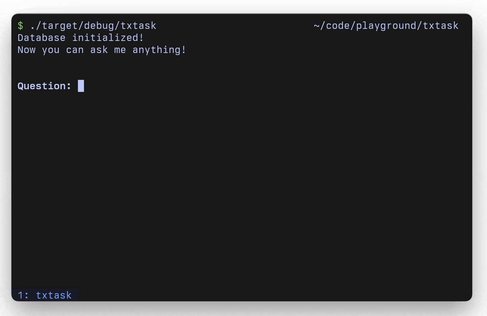

##### Fork changes
Extracted some hardcoded values into constants to make it easier to configure.

# txtask

`txtask` is a CLI application that allows you to chat with your local text files using [Ollama](https://github.com/jmorganca/ollama).



It works by indexing the text files in your `./data` folder and creates an embedding for each chunk of the files. All the embeddings are stored in memory.

Upon receiving an input (the question), `txtask` will calculate the similarity between the embedding of your question and the stored embeddings to find the matching chunks. Then, use these chunks as context to answer the question.

## How to use

You will need to have Ollama installed locally, and run the [Mistral 7B](https://ollama.ai/library/mistral) model:

```
$ ollama run mistral
```

You can use any model you want, but remember to set the correct model in th e `OllamaClient`'s request payload in the code.

Clone the repository to your machine, and run with:

```
$ cargo run
```

txtask will start indexing file markdown files in `./data` folder.

After that, you can start asking questions.

## Cached index

The embeddings are cached in the `database.json` file, and it will be loaded after the first run. So, if you add more text files to the `./data` folder, delete this JSON file so txtask can index them.
